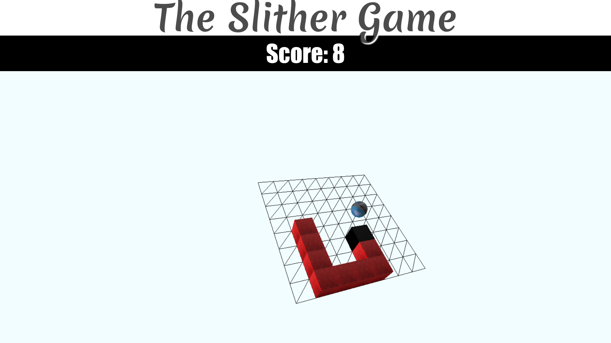

# myslitherio
a snake game made using Three.JS and WebGL

# play
game deployed at: https://abhishekjiitr.github.io/myslitherio/

# screenshots

# requirements
+ Hardware Acceleration: On most browsers including chrome hardware acceleration must be enabled.
  [How to enable WebGL](http://askubuntu.com/questions/299345/how-to-enable-webgl-in-chrome-on-ubuntu)
+ Game must be served on a server.
